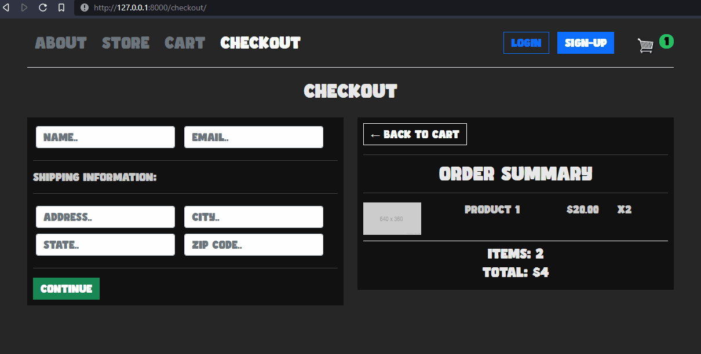

# Coldcut Website - Website Django Project README

### Website Progress

09/19/2022 - I feel like I'm roughly 50% done with what I wanted to achieve with this basic e-commerce website. User authentication was the hardest part of this, I feel, and as far as I know, setting up web applications (such as this project) is relatively simple with DigitalOcean and their Ubuntu servers/droplets. My main focus after finishing authentication and user recognition will be to start finding ways to SHOW you guys (or even just myself) the full order history of the website so we will be able to ship these shirts with minimal hassle. 

## Bonus Features after Launch to be Implemented (maybe?):
-Product Search Bar Function<br/>
-Email Campaigns for regular users<br/>
-Coupon Codes<br/>
-Sync with Instagram store (either manually or automatically)<br/>
<br/>
-Coldcut Portfolio/Music/Band Page - Links, Photos, Branding, Shout-outs, Fan tributes, etc...<br/>
<br/>

## Website Navigation Preview:



#

#

#

# Developer Notes:

These are notes that are meant to help maintain, understand, and re-launch the project in case things go wrong.

#

#

#


```bash
# To refresh the server after changing most files (HTML, CSS, JS)

sudo systemctl daemon-reload
sudo systemctl restart gunicorn
sudo nginx -t && sudo systemctl restart nginx
```


#

# Running the server on winenv Environment (Windows 10):

```python
# settings.py - Use these settings:

DEBUG = True
ALLOWED_HOSTS = []

STATICFILES_DIRS = (
   os.path.join(BASE_DIR, 'static'),
)
```

```bash
# To run the (winenv) on Windows Environment for Django:

& winenv/Scripts/Activate.ps1
```
> Yes, the "&" is necessary. 


```bash
# While in (winenv), run:

python manage.py runserver --insecure
```

> Interestingly enough, because your windows environment and linux environment are separate (for python/django), your super-user in your linux environment is NOT the same as your super-user in your windows environment. This also means you will need to create superusers separately in both your winenv and linux env:

```bash
# Create a super user for BOTH python environments (1 - Linux, 2 - Windows):

python manage.py createsuperuser --username=cocothegorilla
```


# Initial Setup for mySQL, Django, Ubuntu, etc...:

## Setting up Django with Nginx, Postgres, and Gunicorn (on DigitalOcean):
https://www.digitalocean.com/community/tutorials/how-to-set-up-django-with-postgres-nginx-and-gunicorn-on-ubuntu-16-04

> Tips:
>
> When you try to run gunicorn after adding the gunicorn.service file, but something goes wrong, it's probably because the directories you listed are wrong. Check all ...3? places where you list your own directory in the 'gunicorn.service' file. It is a very likely source of your problems. Also, don't forget to check for random added or deleted characters in the service file.
>
>> Protip : When fixing the gunicorn.service file, don't forget to run:
>> ```
>> sudo systemctl daemon-reload
>> sudo systemctl restart gunicorn
>> ```
>> And when you run:
>> ```
>> sudo journalctl -u gunicorn
>> ```
>> Don't forget to SCROLL to the bottom of the output, where all the latest output is. Otherwise, you are only READING OLD ERRORS. Don't waste time with that.


## Get your custom domain to connect to your website:
https://www.digitalocean.com/community/questions/how-to-set-domain-name-django-nginx-ubuntu-16-04


## Fixing Nginx Welcome Page:
https://www.youtube.com/watch?v=MP3Wm9dtHSQ


## Handling "www.(...)" Redirects:
https://www.youtube.com/watch?v=6QYJUvrb7m8

## lookup domain names on ICANN Lookup Tool:
https://lookup.icann.org/en

## certbot for nginx servers on ubuntu machines:
https://certbot.eff.org/instructions?ws=nginx&os=ubuntufocal
https://letsencrypt.org/documents/LE-SA-v1.2-November-15-2017.pdf


# Adding images to the site
### Even though they're [background images] and  is being super weird (and is throwing errors):

https://simpleit.rocks/python/django/call-static-templatetag-for-background-image-in-css/

> Lesson learned: it's okay to throw errors.

# Connecting to the mySQL database remotely and syncing it between two devices

This is the filepath for the mysql settings.
```
/etc/mysql/mysql.conf.d/mysqld.cnf
```

https://stackoverflow.com/questions/4093603/how-do-i-find-out-my-mysql-url-host-port-and-username

TCP Forwarding on host (remote) server for TCP/IP connection:
https://serverfault.com/questions/616696/lost-connection-to-mysql-server-at-reading-initial-communication-packet-syste

Digital Ocean specific:
https://www.digitalocean.com/community/questions/how-do-i-use-ssh-to-access-mysql-remotely


## We need to take some steps to shut down mySQL so that we can edit the root password and access the default database.


```bash
# All-in One Package:
# includes Apache, phpMyAdmin, mySQL, etc...

https://www.apachefriends.org/index.html
```


https://www.inmotionhosting.com/support/edu/cpanel/kill-mysql-processes-phpmyadmin/

https://www.wikihow.com/Install-phpMyAdmin-on-Your-Windows-PC

## Actual easy apache download windows 10:

https://www.apachelounge.com/download/
https://www.youtube.com/watch?v=oJnCEqeAsUk
> PROTIP: Watch the installation directory and unzip process carefully. You unzip into your drive directory, not just anywhere!

install php (on windows 10, 2021)
https://www.youtube.com/watch?v=QMWb_Wn2g5k


## How To Secure MySQL Replication Using SSH on a VPS:

https://www.digitalocean.com/community/tutorials/how-to-secure-mysql-replication-using-ssh-on-a-vps

## How to copy files via SSH :

https://unix.stackexchange.com/questions/106480/how-to-copy-files-from-one-machine-to-another-using-ssh


## pymysql, mysqlclient, etc for Python mysql integration (help): 

https://www.a2hosting.com/kb/developer-corner/mysql/connecting-to-mysql-using-python

## Strict mode in phpMyAdmin for mySQL: 

https://stackoverflow.com/questions/37964325/how-to-find-and-disable-mysql-strict-mode

## Adding objects to django database in django shell (models): 

https://docs.djangoproject.com/en/4.0/intro/tutorial02/

## Django admin area not showing models / database objects: 

https://stackoverflow.com/questions/24813536/django-admin-not-showing-models/24814041

> "Double-check that you've actually registered your models in admin.py"

```py
from MyApp.models import MyModel
admin.site.register(MyModel)
```

> Protip: it may need to be in the APP folder, not your PROJECT folder. I.E.:
> > "project/blog/admin.py" rather than "project/admin.py"

## Display image files from a django model 

https://stackoverflow.com/questions/9498012/how-to-display-images-from-model-in-django/9498359


## Best practices when working with Django models:

https://steelkiwi.com/blog/best-practices-working-django-models-python/

## Displaying one django database object at a time:

https://stackoverflow.com/questions/31942843/displaying-one-django-database-object-on-a-page-at-a-time

## nginx setup with media and static folders for django (serving media files on deployed live website with debug = false):

https://stackoverflow.com/questions/20392741/nginx-errorlocation-directive-is-not-allowed-here-in-etc-nginx-nginx-conf76

## upload_to error

```
newsfeed.Artwork.file: (fields.E202) ImageField's 'upload_to' argument must be a relative path, not an absolute path.
        HINT: Remove the leading slash.
```

```bash
# try 
upload_to = 'artworks/'
# because settings.MEDIA_ROOT is absolute. We want relative!
```

## Variables in Django Templates Help:

> Declaring variables:
>
> https://stackoverflow.com/questions/34710043/how-to-declare-variables-inside-django-templates/34710719

> Access Array Indices:
>
> https://stackoverflow.com/questions/28872390/django-how-to-access-array-index-in-template-using-variable

> Error Handling Try/Except in Django:
>
> https://stackoverflow.com/questions/8524077/catching-exceptions-in-django-templates

> "'xyz' tag is not a registered tag library":
> 
> https://stackoverflow.com/questions/40686201/django-1-10-1-my-templatetag-is-not-a-registered-tag-library-must-be-one-of

> > "How about we skip all that and just use ZIP two combine the two dictionaries?"
> >
> > https://groups.google.com/g/django-users/c/rucw6bKFdz8?pli=1
> >
> > https://www.geeksforgeeks.org/python-convert-two-lists-into-a-dictionary/
> > 
> > https://www.adamsmith.haus/python/answers/how-to-zip-two-lists-in-python


## Customizing django's pre-made templates:

https://docs.djangoproject.com/en/dev/topics/forms/#customizing-the-form-template

## Django email settings:

https://docs.djangoproject.com/en/4.0/ref/settings/#std-setting-EMAIL_TIMEOUT

## gitignore documentation:

https://git-scm.com/docs/gitignore

## Displaying alert messages with Django:

https://www.youtube.com/watch?v=AkkBc_d7OXk

## Appending to python dictionaries (for context return, for example):

https://www.guru99.com/python-dictionary-append.html

## Python if, elif, endif, etc in Django:

https://stackoverflow.com/questions/39247352/how-to-check-if-elif-else-conditions-at-the-same-time-in-django-template

## How to TEST (unit tests) django URLs:

https://stackoverflow.com/questions/18987051/how-do-i-unit-test-django-urls

## Changing secret key in Django:
https://stackoverflow.com/questions/54498123/django-secret-key-generation/54498318
```bash
python -c "from django.core.management.utils import get_random_secret_key; print(get_random_secret_key())"
```

# SECOND RUN: STARTING FROM THE BEGINNING -- SERVER SETUP ON DIGITALOCEAN

> Description: This 'second run' part is specifically made up of new solutions
> I've had to implement for the coldcut website. The 'first part' of this document
> contains a lot of documentation from florasora.com's readme. 

> From here on out, the documentation will tackle new subjects not tackled for
> florasora.com, such as User Authentication, specific REST frameworks, React,
> and various other even more advanced and specific topics.


## SSH Key generation (for secure login to the server)
https://docs.tritondatacenter.com/public-cloud/getting-started/ssh-keys/generating-an-ssh-key-manually/manually-generating-your-ssh-key-in-windows

## Bootstrap v5 for Django (direct installation, rather than linking via web):
https://pypi.org/project/django-bootstrap-v5/

> How to get bootstrap to load in html files in django:
>
> https://django-bootstrap-v5.readthedocs.io/en/latest/quickstart.html#example-template

## How to include custom fonts in Django/CSS/HTML
https://stackoverflow.com/questions/21346045/django-new-fonts

### Text Transparency in html/css:
https://stackoverflow.com/questions/10835500/how-to-change-text-transparency-in-html-css

### Selectors in CSS for various elements:
https://www.portiva.nl/portiblog/blogs-cat/3-levels-of-css-selectors-to-select-all-elements

## Django and React JWT Authentication Tutorial
part 1 - https://www.youtube.com/watch?v=QFDyXWRYQjY
part 2 - https://www.youtube.com/watch?v=fr3yF30GWi0
documentation for djoser - https://djoser.readthedocs.io/en/latest/getting_started.html

> Tip: 'jwt' means JSON Web Token

## How to run npm front-end (React): npm build/ npm run/ npm install help

https://stackoverflow.com/questions/43664200/what-is-the-difference-between-npm-install-and-npm-run-build

## Extra npm installs:

> These are added in after some other django/react JWT support libs are installed. Meaning that
>
> this list is not exhaustiv--there is a part 1.

```
npm install --save axios react-router-dom redux redux-devtools-extension react-redux redux-thunk
```

> Overall, these tools will help us implement redux in the application and debug what's going on.

## React issues:

### Getting the basic index.html page to show correctly:

https://github.com/facebook/create-react-app/issues/4438
> "make sure you run this route"
> > (Route proceeds to include specifically index.html and not whatever .html I think I want.)

https://reactrouter.com/docs/en/v6/getting-started/tutorial
> React Router tutorial

```
npm audit
npm audit fix --force
```

### createStore versus configureStore:

https://redux-toolkit.js.org/api/configureStore
https://redux.js.org/introduction/why-rtk-is-redux-today


## Virtual Environments (venv) for both Windows and Linux:

https://www.geeksforgeeks.org/creating-python-virtual-environment-windows-linux/

```bash
# ----
# FOR WINDOWS:
# ----

# Install virtualenv
pip install virtualenv

# Create a virtualenv
virtualenv mywinenv

# Activate the virtualenv
mywinenv\Scripts\activate

# if that doesn't work, try:
& 'mywinenv\Scripts\Activate.ps1'

# to Deactivate the virtual env:
deactivate

```

```bash
# ----
# FOR LINUX:
# ----

# Install pip
sudo apt-get install python-pip

# Install virtualenv
pip install virtualenv

# Check version of virtualenv
virtualenv --version

# Create a virtual environment
virtualenv myenv

# for specific python versions:
virtaulenv -p /usr/bin/python2.7 myenv

# activating the env:
source myenv/bin/activate

# deactivating the env:
deactivate

```

## Updating Python:

https://www.pythoncentral.io/how-to-update-python/

> On windows, you cannot update python with pip.
>
> Download the windows python installer from the official website.


## React Documentation - Practical Tutorial:

https://reactjs.org/tutorial/tutorial.html

## React / Django 2022 Tutorial:

https://www.youtube.com/watch?v=rxRYEXBmM88

```bash
# Jist of the terminal commands (for a django/react project geared for user authentication):
>virtualenv winenv
>winenv/Scripts/Activate
>pip install django
>django-admin startproject coldcmerch
>cd coldcmerch
>python manage.py startapp users
# need json webtoken authentication and REST framework compatibility:
>pip install djangorestframework djangorestframework-simplejwt
```

## 'Django Rest Framework' Documentation:

https://www.django-rest-framework.org/

## Django customizing user models documentation:

> tags: overriding, is_staff, is_admin, AUTH_USER_MODEL setting, custom user model

https://docs.djangoproject.com/en/4.0/topics/auth/customizing/

## Server Error Codes for Django Rest Framework (404, 504, etc...):

https://www.django-rest-framework.org/api-guide/status-codes/

## editing package.json inside react/client/src for development auditing:

Add this into package.json inside react/client/src:

```
"devDependencies": {
    "react-scripts": "5.0.1"
  },
```

## Django/React/Redux/Express Useful console commands:

```bash
# test the project for vulnerabilites as if it were in production (rather than dev)
npm audit --production
```

## VSCode Multiple Line Selections for faster editing:

https://code.visualstudio.com/docs/editor/codebasics

## Running the Server Project (for development/locally):

```bash
# terminal window 0 - Run Django
cd coldcmerch
python manage.py runserver

# terminal window 1 - Run React
cd react
cd client
npm start

# terminal window 2 - Run Express
cd react
npm start

```

## Clear your project's database:

```bash
python manage.py flush
yes
```

## ${} isn't working in Javascript ("template literals"):

https://stackoverflow.com/questions/37245679/ecmascript-template-literals-like-some-string-are-not-working

> Summary: template literals require grave accents, not straight quotation marks
>
> i.e.: <`> and not <'>

## localhost versus 127.0.0.1! (I want to murder!)

When attempting to bridge React and Django via django's api views and urls, try changing localhost:8000 within the react directory to 127.0.0.1:8000. This is because Django runs on 127.0.0.1, not on localhost. Weird, right? Imagine spending 12 hours trying to fix that problem. Not me! Ahahahaha.

## ManyToMany - Product Attributes, Sizes, Colors, Images, and so on...

https://stackoverflow.com/questions/69199430/django-models-for-creating-multiple-variations-of-t-shirts

## Properly storing images in Django/media/static with models fields:

https://stackoverflow.com/questions/34563454/django-imagefield-upload-to-path

## Cart Example Django:

https://github.com/bmentges/django-cart/blob/master/cart/models.py

## Display Frontend Categorization of Models in html via Django:

https://stackoverflow.com/questions/48670101/django-list-items-based-on-a-foreign-key

## Display BACKEND Admin.py Categorization of Model Objects in /admin via Django:

https://docs.djangoproject.com/en/3.2/intro/tutorial07/

This was so useful for displaying everything Coldcut will need on one page! SICK! They'll be able to add shirt sizes, colors, and images with just a few clicks! (if they ever need to)