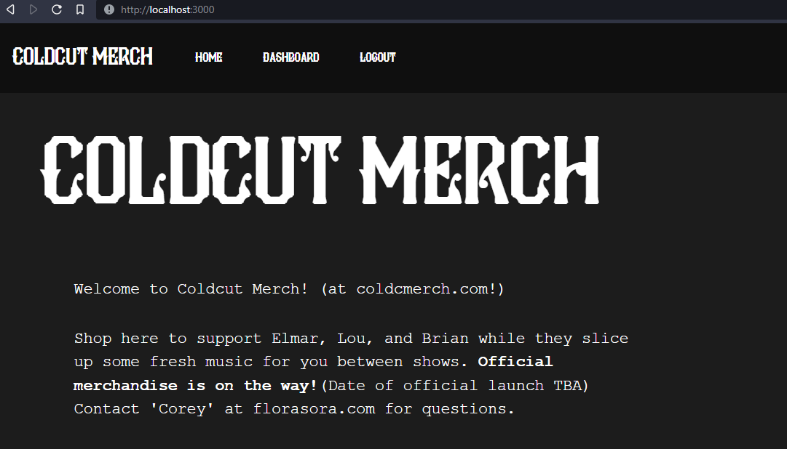

# Coldcut Website - Website Django Project README

### Website Progress Journal

> 09/19/2022 - I feel like I'm roughly 50% done with what I wanted to achieve with this basic e-commerce website. User authentication was the hardest part of this, I feel, and as far as I know, setting up web applications (such as this project) is relatively simple with DigitalOcean and their Ubuntu servers/droplets. My main focus after finishing authentication and user recognition will be to start finding ways to SHOW you guys (or even just myself) the full order history of the website so we will be able to ship these shirts with minimal hassle. 

> 09/26/2022 - APIs are fun and interesting. I really can't wait to get out of this backend jungle and start working more on the UI so that Cold Cut can really see what I've been working on. What I do have future concerns of are API backend security measures, and launching specifically the React frontend for the server during production. I'm not sure how nginx handles all of that stuff. Another concern is the cost-effectiveness of using a DigitalOcean server for a website that may be accessed by possibly hundreds of users in a day. How badly will this affect server costs? Will I need to take a larger cut of profits in order to pay to run the server? To be determined.

> 11/11/2022 - I have learned a lot. This was supposed to be a 2-month project. Now it's looking like an 8 month project. Todo: implement the store.

> 01/07/2023 - Store implemented on Frontend. That means you can see it. What you can't do yet: Interact with the store, add things to cart, or reset your password. But you can login, log out, register, and browse the store. So basically it would function as a fun little toy shop. But it's not useful yet for e-commerce. Let's keep pushing.

### What are you working on at THIS MOMENT?

Check out my project page at https://github.com/users/CoreyWarren/projects/5 .

There, you will see a list of issues that I have (mostly) resolved and am "Done" with. And, you will also see several tiers of issues that I will work on soon, and those I will work on later. It should also give you a good idea of where I'm at: setup, launch, or maintenance.

## Website Navigation Preview

