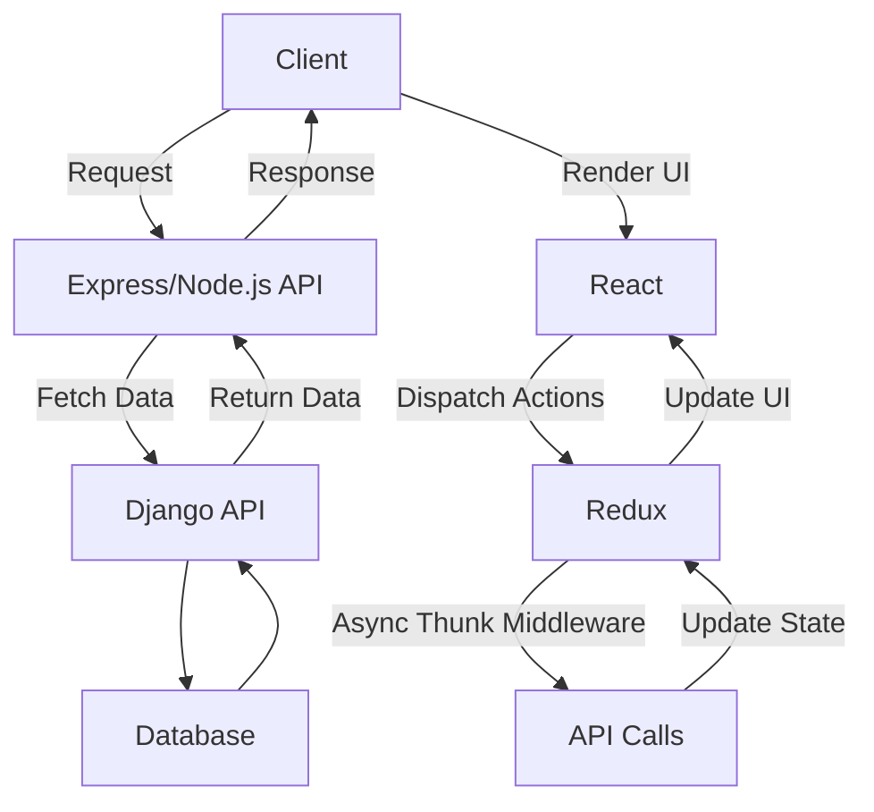
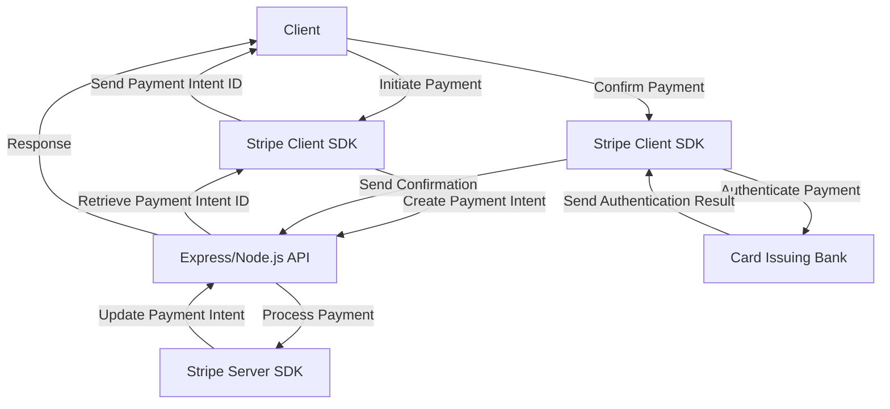
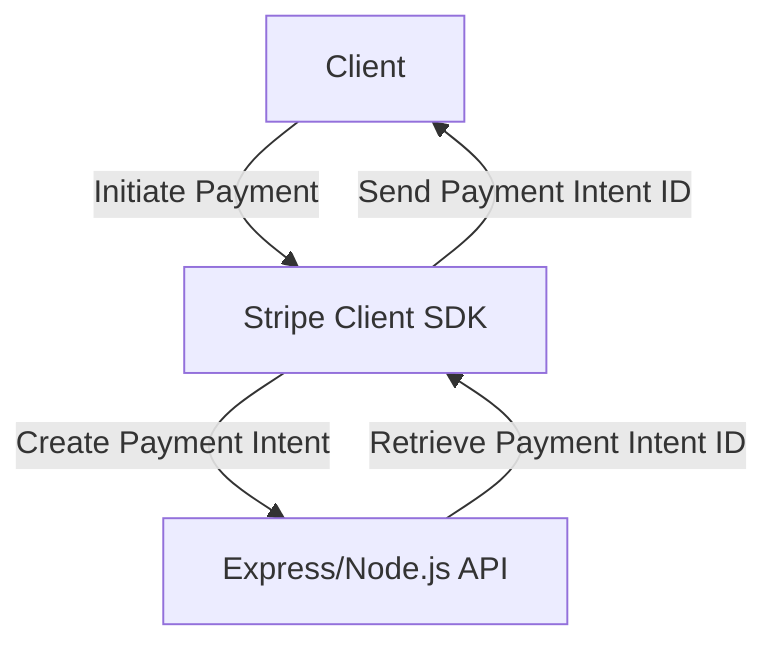
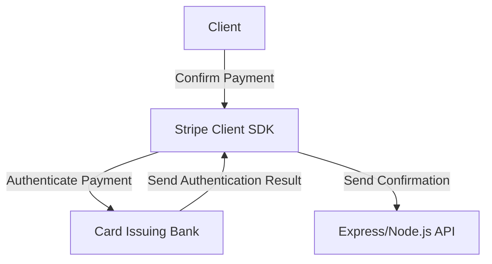
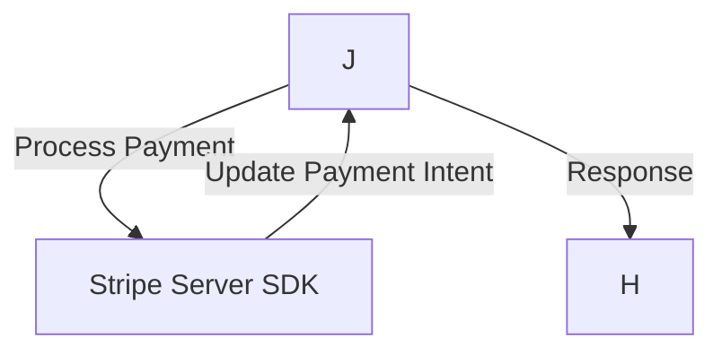

# &#x1F4CC; Coldcut Website Code - README

Welcome to ColdCut's upcoming E-Commerce website. We intend to sell shirts and other merchandise here, utilizing Stripe to handle payments securely. This is also my portfolio's centerpiece. Albeit unfinished, this is a complex and multi-month Full-Stack Web Development project that I take great pride in working on!

### Figure 1.1: *Client-Server Communication:*

The above chart illustrates the communication flow between the client and server-side components of a web application. The client sends requests to the server-side API to fetch data from the database, which is then returned to the client for rendering the UI. The client also dispatches actions to update the state of the application, which trigger API calls to update the server-side database.

### Figure 2.1: *Stripe Payment Flow (with Intents):*



This chart illustrates the payment flow for a web application that utilizes Stripe Payment Intents. The client initiates the payment using the Stripe Client SDK, which creates a Payment Intent on the server-side. The Payment Intent ID is then sent back to the client, which confirms the payment using the Stripe Client SDK. During the payment process, Stripe may request authentication from the card issuing bank, which is handled by the Stripe Client SDK. Once the payment is confirmed, a confirmation is sent back to the server-side and the Payment Intent is updated to reflect the payment status. Finally, a response is sent back to the client to complete the payment process.

### Figure 2.2: *Payment Initiation:*



### Figure 2.3: *Payment Confirmation:*



### Figure 2.4: *Payment Processing:*




# &#x1F4C8; What's happening with this project?

Check out my project page at [Coldcut Github Project Planner](https://github.com/users/CoreyWarren/projects/5) for all my todo-lists and closed (completed) issues.

<br>


# &#x1F4F1; UI Preview

As of this update, what works so far:

- User Login
- User Registration
- Store Layout
- Dashboard Layout


To be improved:

- Cart Page
- Cart Notifications
- Login/Registration Input Fields and Buttons 

To be added:

- Reset Password
- Email System


# &#x1F4D9; What technologies are used here?

- Django (Back-end Web Development, API, REST)
- React 18 (Front-End Web Development, Fetching)
- NodeJS (React Installation)
- Github (Project Management and Organization)
- Redux (Store/State Management and Organization)
- Express (Router: Cookies and Async Requests)
- Python 3.10.4 (Django)
- JavaScript (React)
- VSCode (Coding Environment)
- CSS (Web Styling Language)
- HTML (Web Markup Language)
- DigitalOcean (Web Hosting)
- Google Domains (Domain Name)

<br>

# &#x1F4AC; Progress Journal

> 09/19/2022:

> I feel like I'm roughly 50% done with what I wanted to achieve with this basic e-commerce website. User authentication was the hardest part of this, I feel, and as far as I know, setting up web applications (such as this project) is relatively simple with DigitalOcean and their Ubuntu servers/droplets. My main focus after finishing authentication and user recognition will be to start finding ways to SHOW you guys (or even just myself) the full order history of the website so we will be able to ship these shirts with minimal hassle. 

<br>

> 09/26/2022:

> APIs are fun and interesting. I really can't wait to get out of this backend jungle and start working more on the UI so that Cold Cut can really see what I've been working on. What I do have future concerns of are API backend security measures, and launching specifically the React frontend for the server during production. I'm not sure how nginx handles all of that stuff. Another concern is the cost-effectiveness of using a DigitalOcean server for a website that may be accessed by possibly hundreds of users in a day. How badly will this affect server costs? Will I need to take a larger cut of profits in order to pay to run the server? To be determined.

<br>

> 11/11/2022:

> I have learned a lot. This was supposed to be a 2-month project. Now it's looking like an 8 month project. Todo: implement the store.

<br>

> 01/07/2023:

> Store implemented on Frontend. That means you can see it. What you can't do yet: Interact with the store, add things to cart, or reset your password. But you can login, log out, register, and browse the store. So basically it would function as a fun little toy shop. But it's not useful yet for e-commerce. Let's keep pushing.

<br>

> 01/14/2023:

> Just reviewed how backend works. Worked on serializers a bit, worked on views, and added a new API for looking at product sizes. Nice! Backend is fresh in my mind again. Working between frontend and backend should be much easier from here on out. My todo list is in the projects tab of this repository, but here's a quick review on what's left:
> - Add to Cart functionality
> - Product Size/Color custom ordering
> - Integrate with Stripe
> - Secure API endpoints against attacks
> - Deploy Django and React together to serve as a single website - ColdCMerch.com!

<br>

> 01/24/2023:

> I just did a HUGE change that made me look over how React works, including its Hooks and why the Rules of Hooks are what they are. Instead of trying to force Redux to work with both the Rules of Hooks and my insane 'logic' as to how I wanted to interpret size data for each product with its own separate API call, I opted to just re-write some sections in around 4 JS files around the project, as well as the API for Sizes in Django. Some CSS doodling around, importing react-bootstrap and such here and there, and BAM! We've got a nice looking storefront, with (visually) working dropdown buttons for sizes! 
> 
> This is particularly a huge step because when I learned how to bring product details into the fray, I learned how to import API data into a page. Now, it's slightly different. I learned to obey the Rules of Hooks, and call MULTIPLE APIs at once in a page. I learned how to keep rendering separate from logic. I learned how to make React and Redux work together despite how difficult Redux can be, and how few resources there are for Redux when compared to React. 
> It has truly been a great week, despite the 6 or so other days of pure pain.
> 
> I also just wanted to note that most of the solution for this fix came to me last night after days of dwelling on it. 95% of the working code pushed today was written... today. Aside from learning React, Redux, and Django REST, I'm also learning about myself and my work cycles.
>
> What's next?
> - Add functionality to 'Add to Cart' buttons (need to POST to our Django Back-End)
> - Add functionality to 'Sizes' buttons (this is the next huge step)
> - Add the product COLORS dropdown menu (Set-up API, Routes, Slice, and Reducer...)

<br>

> 03/07/2023:

> It's been an uneventful year, it feels like. Just grinding a bit thru Stripe's documentation, only to realize that I need to do Cart Item infrastructure before even being really able to test Stripe out.

> This means that I'll need to make "Add to Cart" actually functional before even thinking too hard about Stripe implementation.

> With all this in mind, so long as deployment doesn't give me a really hard time, I think I am roughly 70% done at this point. What needs to be done:

> - "Add to Cart" button functionality, along with all other sub-components (sizes)
> - Stripe functionality
> - User account control functions (change pass, delete account)
> - User Order History

> I'm praying that I'm consistent enough to finish this by Summer. I'd love to start making just a little drip-feed of client subscription money without the need to work for a big company. I sit here typing this at the library. Hopefully a good omen for the rest of the year. They say a recession is likely coming, and crypto may experience further drops, akin to the DOTCOM crash. Let's get it!

<br>

# &#x1F528; Running the Code

You need Node.js installed, as well as Python (the correct version), and all related requirements found in django-requirements.txt.

Open powershell, or your desired IDE with access to a shell.
```bash
#
# 1. Start Django.
#

### (Open a new terminal in the project's parent folder) ###
# Navigate into the Django folder
cd django

# Create your environment, then run it with this command in Windows:
& "./winenv/Scripts/activate"

# Navigate into the Application folder
cd coldcmerch

# Run Python, which will run Django via manage.py
python manage.py runserver


#
# 2. Start React
#

### (Open a new terminal) ### 

# Navigate into React
cd react

# 2.1 Start Express :
npm start
# It will say something like "starting 'node index.js' and 'Server listening'

### (Open a new terminal) ###

# 2.2 Start React itself:
# Navigate into the main application folder with the React source code:
cd react
cd client
# Make sure your extensions are installed from package.lockjson:
npm install
# Start React:
npm start


```

# &#x1F528; Deployment

> To be added after Deployment...

# &#x1F528; Maintenance Notes

> To be added after Deployment...

# &#x1F528; Dependencies

> To be added after Deployment...

# &#x1F5C1; Folder Structure

> To be added after Deployment...
